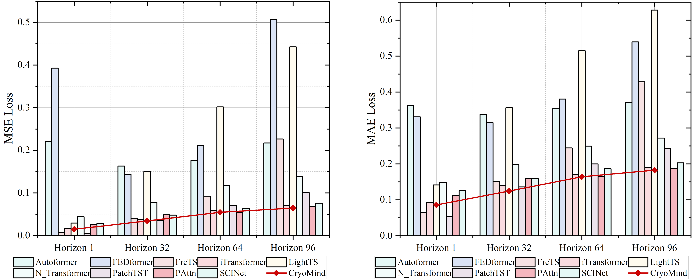
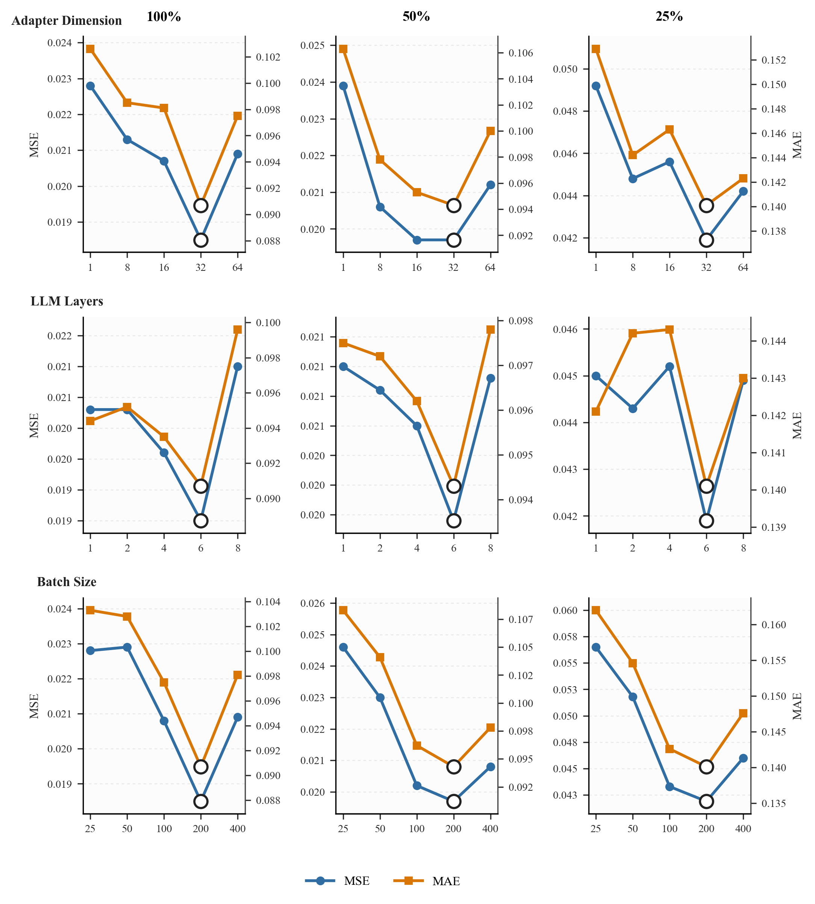

# GLACIER 🧊

**A Cross-Modal Knowledge-Enhanced Large Language Model Framework for Data-Efficient Cooling Load Prediction in Green Data Centers**

<p align="center">
  <a href="https://github.com/fine68/GLACIER"></a>
  <a href="https://huggingface.co/datasets/Fine6868/DCData"></a>
  
  
</p>

> **GLACIER** = **G**reen data center **L**arge language model with **A**daptive **C**ross-modal **I**ntegration for **E**nhanced **R**easoning — a cross-modal LLM framework for **few-shot cooling-load forecasting** in green data centers.

---

## 📖 Overview

Accurate cooling-load forecasting is essential for the efficient operation of green data centers. Yet existing methods degrade sharply in few-shot settings caused by **cold start, data scarcity, and distribution shift**.

GLACIER is built on an **energy-domain specialized LLM** backbone and integrates three key designs:

- 🧠 **Structured textual priors** — encode time-series data + domain knowledge into a context-aware template
- 🔗 **Cross-modal representation alignment** — coordinate the representation spaces of the text encoder and the time-series encoder
- ⚙️ **Dynamic device-coupling modeling** — explicitly characterize the evolving dependencies among chillers, cooling towers, terminal air-conditioning systems, and IT loads

We also release **DCData**, the first public benchmark dataset for this task.

<p align="center">
  <br>
  <em>Figure 2. Training workflow and architecture of GLACIER (A: energy-domain LLM pretraining · B: data collection & training · C: framework overview · D: EGIA mechanism).</em>
</p>

<p align="center">
  <br>
  <em>Figure 2. Training workflow and architecture of GLACIER (A: energy-domain LLM pretraining · B: data collection & training · C: framework overview · D: EGIA mechanism).</em>
</p>

---

## ✨ Highlights

| | Module | Role |
|---|---|---|
| 📊 | **DCData dataset** | Standardized public benchmark with temperature, humidity, inlet/outlet cooling-water temperatures, etc. |
| 🧠 | **Context-Aware Temporal Synthesis Template** | Textual priors: domain background, task instruction, trend description, statistical summary |
| 🔗 | **KARI** (Knowledge-Aligned Representation Integration) | Contrastive alignment of text and time-series representations to improve prior utilization |
| ⚙️ | **EGIA** (Enhanced Global Interaction Attention) | Models dynamic inter-device coupling as a structural prior |
| 🏭 | **Energy-Domain LLM Backbone** | Built on Helios (Qwen2.5-7B architecture) to close the energy-knowledge gap of general-purpose LLMs |

---

## 🎯 Challenges

<p align="center">
  <br>
  <em>Figure 1. Challenges in cooling-load forecasting for green data centers: (A) data-acquisition level · (B) architecture level.</em>
</p>

- **Data-acquisition level**: cold start, data scarcity, renewable-driven distribution drift, confidentiality/compliance constraints
- **Architecture level**: RNN long-range decay · CNN loses temporal order · Transformer single-modality limits · LLM numeric-serialization/alignment semantic gap

---

## 🏗️ Method

GLACIER forward pipeline:

```
Time-series input x(j)
   │  ① Reversible Instance Norm (RevIN)      ② Text template T_CATS = [domain knowledge T_b , text-ized series T_s]
   ▼                                              ▼
[EGIA time-series encoder] ──► V_E         [Text Encoder + Text Adapter (k=32 queries)] ──► V_D / V_t
   │                                              │
   └──────────►  KARI contrastive alignment (τ=0.07)  ◄──┘
   │
   ▼  ③ Concatenate V_in = [V_D , V_E]
[Frozen Energy-Domain LLM (first 6 layers)]  ──►  linear projection + inverse-norm  ──►  prediction ŷ(j)
```

**Key equations**

- EGIA attention: `V_E = Softmax(QKᵀ/√d) · H`
- KARI contrastive loss: `L_KARI = -log [ exp(C(V_t, V_s)/τ) / Σ_k exp(C(V_t, V_s^(k))/τ) ]`
- Training objective: `L_MSE = (1/K) Σ (ŷ_k - y_k)²`

> During training, **all parameters except the output prediction head are frozen** to preserve the pretrained trend-inference and reasoning capability.

---

## 📈 Results

### Data-sufficient setting (100% training data)

GLACIER ranks first on most prediction horizons, with average **MSE ↓ 7.1%** and **MAE ↓ 5.1%** over the best baseline.

| Method | MSE (96) | MAE (96) |
|---|---|---|
| iTransformer | 0.0203 | 0.0977 |
| SCINet | 0.0217 | 0.1025 |
| PatchTST | 0.0211 | 0.1008 |
| **GLACIER** | **0.0185** | **0.0907** |

### Few-shot setting (advantage grows as data shrinks)

| Training data | Avg. MSE reduction | Avg. MAE reduction |
|---|---|---|
| 100% | 7.1% | 5.1% |
| 50% | 6.7% | 4.6% |
| **25%** | **10.5%** | **7.5%** |

<p align="center">
  <br>
  <em>Figure 4. Model performance with 25% training data (horizons = 1/32/64/96).</em>
</p>

### Ablation study

| Removed module | Avg. MSE reduction | Avg. MAE reduction |
|---|---|---|
| w/o Text Modality | **25.74%** | **15.62%** |
| w/o Energy-Domain LLM | 11.84% | 7.82% |
| w/o EGIA | 11.36% | 6.53% |
| w/o KARI | 6.10% | 3.43% |

> The text modality contributes most; KARI is the most data-dependent (larger gains with more data).

### Parameter sensitivity

<p align="center">
  <br>
  <em>Figure 5. Sensitivity to key hyperparameters: query number k=32, LLM layers=6, batch size=200 are optimal.</em>
</p>

---

## 📦 Dataset (DCData)

```python
from datasets import load_dataset
ds = load_dataset("Fine6868/DCData")
```

- 🤗 Hugging Face: https://huggingface.co/datasets/Fine6868/DCData
- Covers multiple categories of key operational parameters (temperature, humidity, inlet/outlet cooling-water temperatures, ...)


---

## 📚 Citation

If this work helps your research, please cite:

```bibtex
@article{jiang2026glacier,
  title   = {GLACIER: A Cross-Modal Knowledge-Enhanced Large Language Model Framework
             for Data-Efficient Cooling Load Prediction in Green Data Centers},
  author  = {Jiang, Haoyu and Qu, Boan and Wang, Songjie and Zhu, Junjie and Cheng, Xu
             and Du-Ikonen, Liuliu and Zeng, Fanjie and Wu, Lifei and Li, Manjie
             and Zhong, Wei and Zhang, Xu and Chen, Jiaying and Jiang, Long and Lin, Xiaojie},
  year    = {2026}
}
```

This article is the extended journal version of our conference paper **Hyperload (AAAI 2026)**:

```bibtex
@inproceedings{jiang2026hyperload,
  title     = {Hyperload: A Cross-Modality Enhanced Large Language Model-based Framework
               for Green Data Center Cooling Load Prediction},
  author    = {Jiang, Haoyu and Qu, Boan and Zhu, Junjie and Zeng, Fanjie and Lin, Xiaojie and Zhong, Wei},
  booktitle = {AAAI},
  pages     = {480--488},
  year      = {2026},
  doi       = {10.1609/aaai.v40i1.37011}
}
```

---
